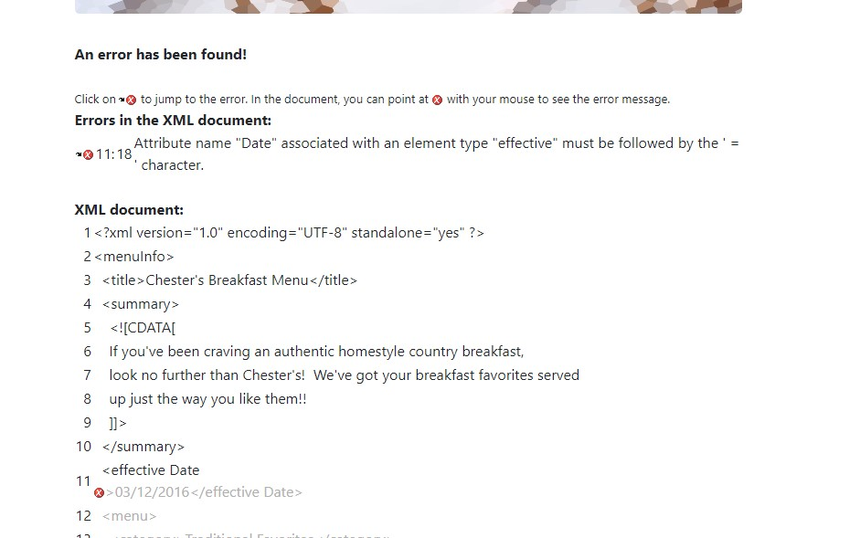
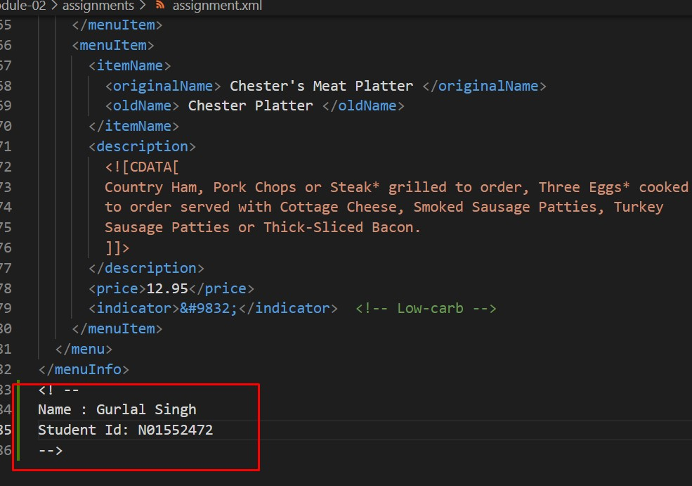
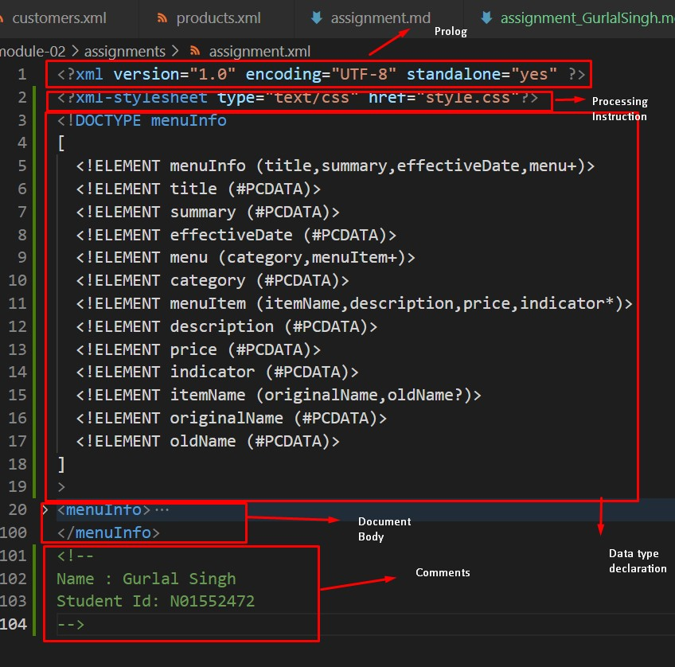
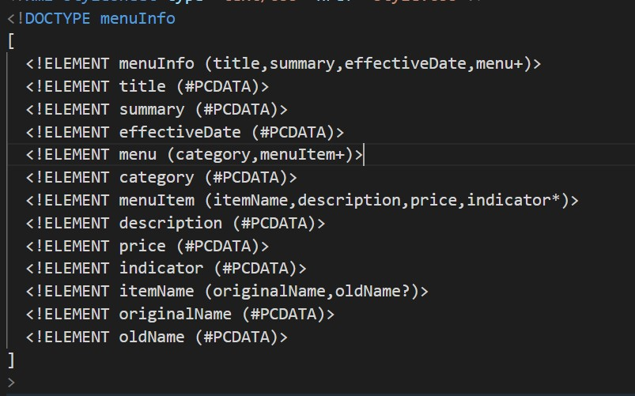
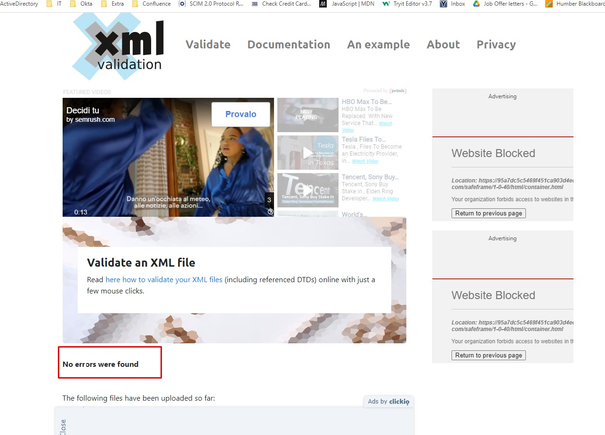
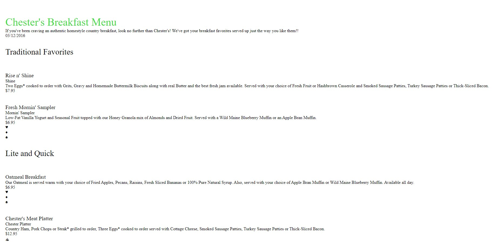

1. Open `module-2/assignments/assignment.xml` in your browser. Are there any errors? Explain the error and fix it.
Answer: When validated the xml file in browser found the following errors:
  a. effective Date tag contain space in between.
  b.one of the originalname closing tag has issue with case sensitive spelling issue.
  c. one opening tag name has different name in its closing tag.

  fixes:
  a. removed the space between and changed it to effectiveDate.
  b. changed originalname to originalName to make it same as opening tag.
  c. changed opening tag name to originalName so that should be similar to other sections tags.

  

2. What is the use of CDATA block in this document?
Answer: The CDATA in assignment xml used in two places. First two define the tag line for the restaurant under the summary tag. Second it is used to give the breif information of each menu item under description tag.

3. Add comment line to the end of file which contains you name and student id.
Answer: 

4. Identify prolog, document body, and epilog in the document. Are there any processing instructions?
Answer: 

5. Add inline DTD for this document.
Answer: 

6. Verify that file is well-formed and valid.
Answer: 

7. Create `style.css` file and link it to the file. Add the following styles to the .css:

- Change font-size of `originalName`
- Display each `category` on the new line
- Add any other css-rule

Answer: 