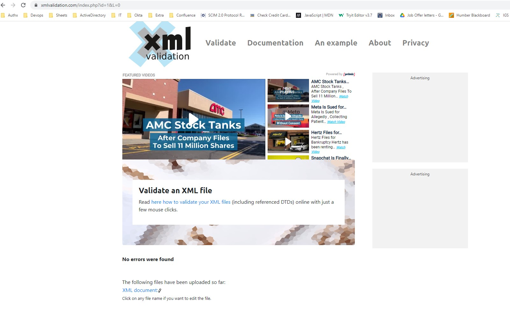
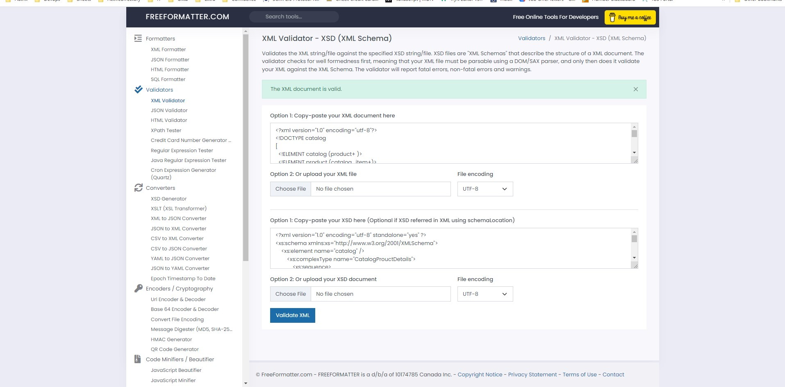

# Assignment

1. Create DTD for this file and validate it using any of the tools we used
 
2. Create XSD for this file and validate it using any of the tools we used
 
3. Explain your thought process for these 2 declarations

-- DTD: 1. Readability is difficult.
-- 2. Increase file size as DTD written on same file.
-- 3. We can specify the type of data available under particular tag.

-- XSD: 1. Readability is easy.
-- 2. Schema placed in different file so easy to maintain and won't increase actual xml file size.
-- 3. we can specify the type of data in tag by importing the default xml schema.